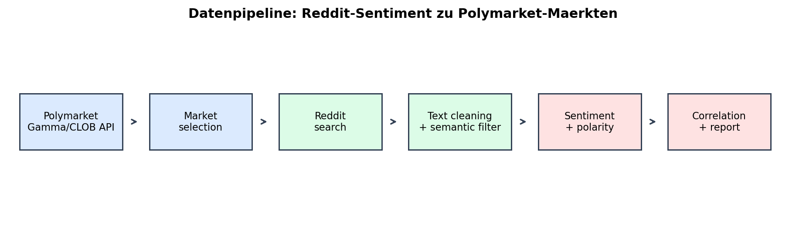
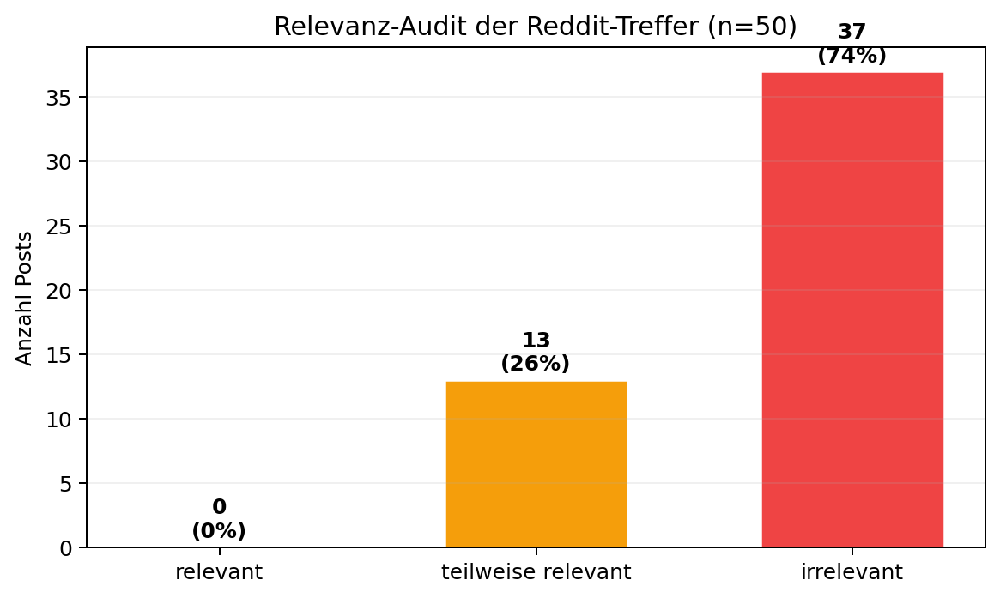
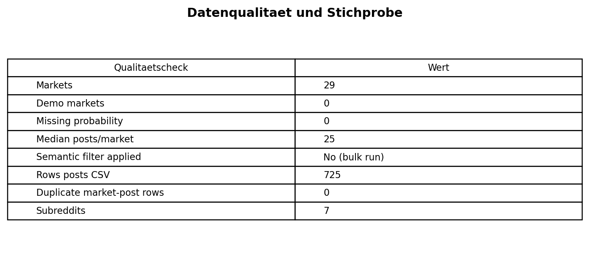
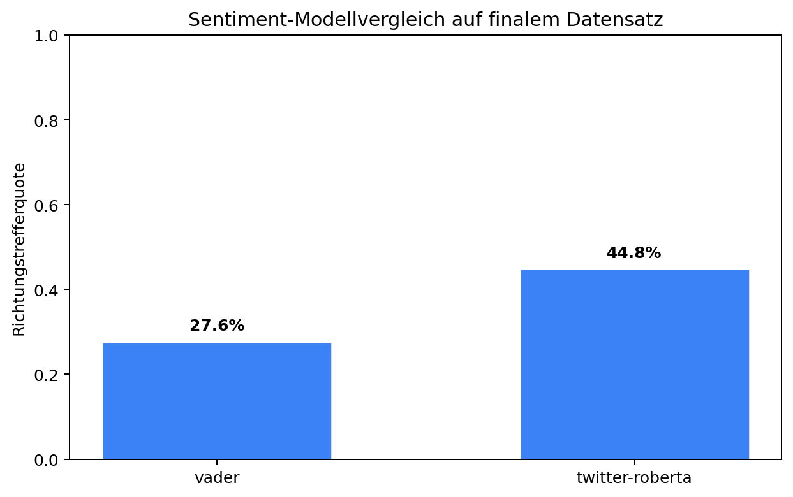
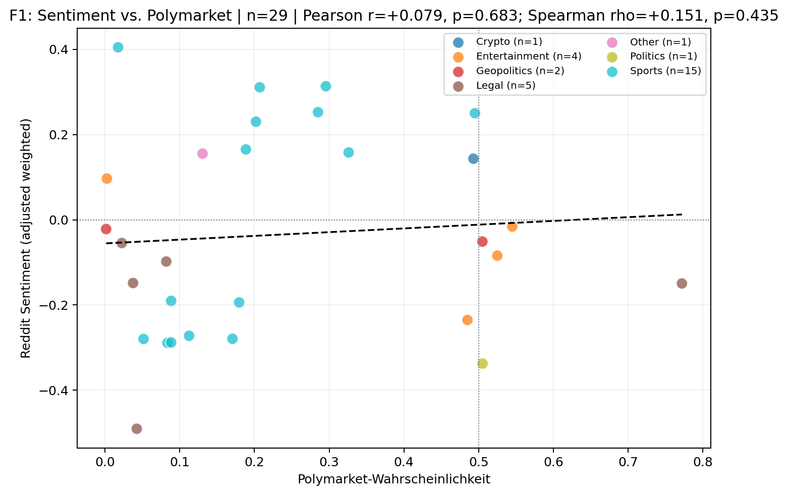
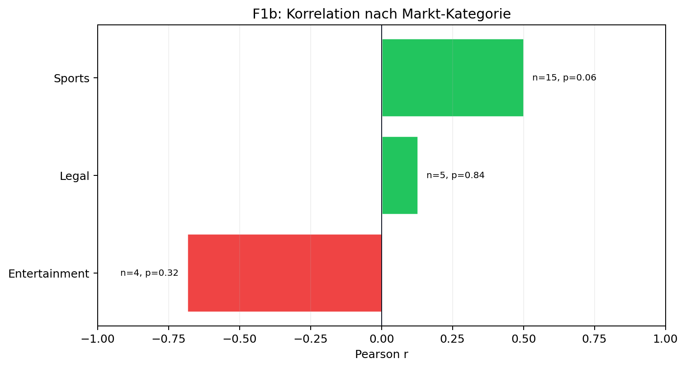
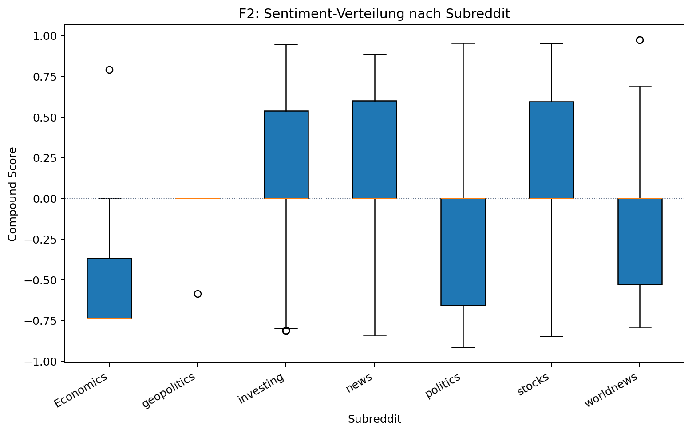
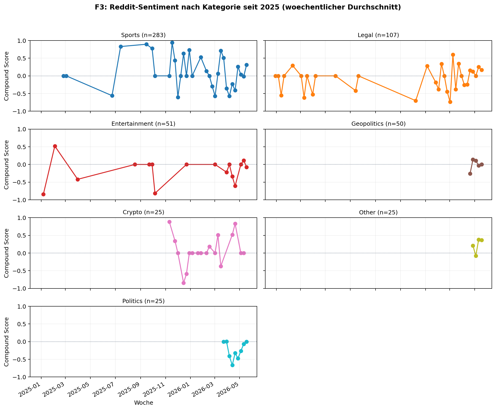
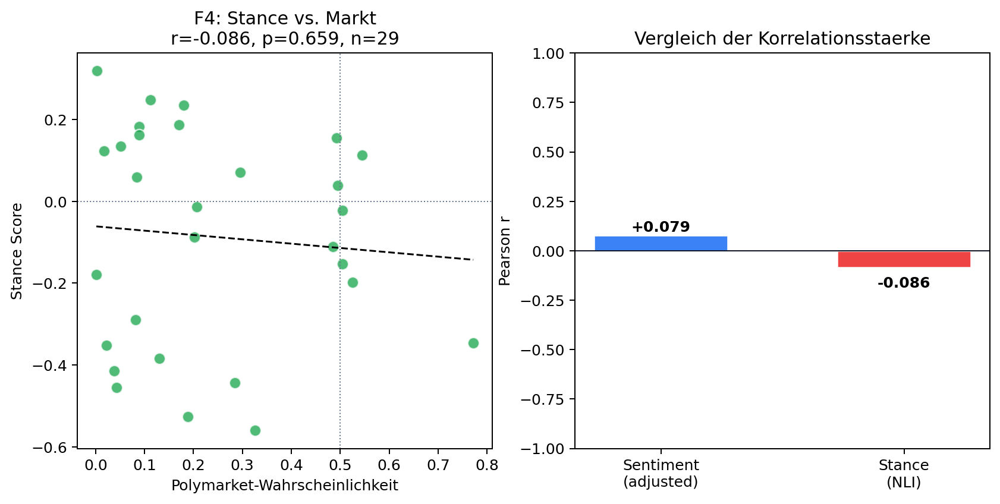

# Polymarket Reddit Sentiment

**Projektbericht für Data Wrangling & Engineering FS26**  
**Autoren:** Pablo Cruz und Daliah Beck  
**Finaler Live-Run:** 22.05.2026, 12:29 UTC  
**Datengrundlage:** 29 Polymarket-Märkte, 725 Reddit-Posts, 7 Subreddits, keine Demo-Fallback-Daten

## Management Summary

Dieses Projekt untersucht explorativ, ob die Stimmung in Reddit-Diskussionen mit den aktuellen Wahrscheinlichkeiten von Polymarket-Vorhersagemärkten zusammenhängt. Dafür werden aktive Polymarket-Märkte per API geladen, aus den Marktfragen Reddit-Suchbegriffe abgeleitet, passende Posts gesammelt, mit Twitter-RoBERTa klassifiziert und pro Markt zu Sentiment-Scores aggregiert. Zusätzlich wird mit einem Zero-Shot-NLI-Modell ein Stance-Score berechnet, der direkter misst, ob Reddit-Posts das Eintreten eines Ereignisses unterstützen.

Das wichtigste Ergebnis ist methodisch sauber, aber inhaltlich vorsichtig zu interpretieren: Im finalen Live-Datensatz zeigt sich **kein statistisch signifikanter linearer Zusammenhang** zwischen Reddit-Sentiment und Polymarket-Wahrscheinlichkeiten. Die Hauptrangkorrelation ist ebenfalls nicht signifikant. Die Richtung der Signale stimmt in **13 von 29 Märkten (44.8%)** überein. Nach der verbesserten, spezifischeren Reddit-Query ist dieser Richtungswert deutlich konservativer als in der früheren Version. Das ist inhaltlich plausibel: Die neue Suche reduziert einige zufällige breite Treffer, zeigt aber auch klarer, dass Reddit-Sentiment allein keine robuste Prognose für Polymarket-Preise liefert.

Aus Sicht des Data Wrangling ist das Projekt relevant, weil es mehrere praktische Arbeitsschritte verbindet: API-Datenbeschaffung, Textdaten-Wrangling, Datenqualitätsprüfung, Harmonisierung heterogener Datenquellen, NLP-Transformationen, statistische Analyse, Visualisierung und reproduzierbare Pipeline-Ausführung.

## 1. Konzept, Fragestellung und Datenauswahl

Prediction Markets wie Polymarket bilden Markterwartungen als Preise zwischen 0 und 1 ab. Ein Preis von 0.50 entspricht grob einer vom Markt implizierten Wahrscheinlichkeit von 50%. Reddit enthält parallel dazu öffentliche Diskussionen, Nachrichtenreaktionen und subjektive Einschätzungen zu denselben Themen. Die zentrale Projektidee ist, diese beiden sehr unterschiedlichen Datenquellen zu verbinden und zu prüfen, ob sie ähnliche Signale liefern.

### Forschungsfragen

1. **F1:** Korrelieren Reddit-Sentiment-Scores mit Polymarket-Wahrscheinlichkeiten?
2. **F1b:** Unterscheidet sich diese Korrelation nach Marktkategorie?
3. **F2:** Unterscheidet sich das Sentiment signifikant zwischen Subreddits?
4. **F3:** Gibt es zeitliche Muster im Reddit-Sentiment?
5. **F4:** Korreliert ein Stance-Score stärker mit Polymarket-Wahrscheinlichkeiten als reines Sentiment?

### Finale Stichprobe

| Kennzahl | Wert |
|---|---:|
| Polymarket-Märkte | 29 |
| Reddit-Post-Zeilen | 725 |
| Subreddits | 7 |
| Demo-Fallback-Märkte | 0 |
| Durchschnitt Posts pro Markt | 25.0 |
| Median Posts pro Markt | 25 |
| Sentiment-Modell | Twitter-RoBERTa |
| Stance-Modell | DeBERTa-v3 Zero-Shot NLI |

Die Live-Polymarket-API lieferte 100 aktive Märkte; daraus wurden 30 relevante Märkte für den Bulk-Run ausgewählt. Ein Markt wurde ausgeschlossen, weil die Reddit-Suche keine ausreichenden Posts fand. Der finale Datensatz enthält daher 29 auswertbare Märkte. Das liegt innerhalb der geplanten Akzeptanzspanne von 25 bis 30 Märkten.

### Marktkategorien

| Kategorie | Märkte |
|---|---:|
| Sports | 15 |
| Legal | 5 |
| Entertainment | 4 |
| Geopolitics | 2 |
| Politics | 1 |
| Crypto | 1 |
| Other | 1 |

Die aktuelle Polymarket-Live-Auswahl war stark von Sport-, Legal- und Entertainment-Märkten geprägt. Das ist ein wichtiger Befund zur Datenauswahl: Die API liefert nicht automatisch eine fachlich balancierte Stichprobe. Deshalb wird die Marktkategorie im Projekt bewusst dokumentiert und nicht nachträglich versteckt.

## 2. Datenbeschaffung und Pipeline



Die Pipeline folgt einem ETL-Muster:

1. **Extract:** Aktive Polymarket-Märkte werden über Gamma/CLOB geladen. Für jede Marktfrage werden Suchbegriffe extrahiert. Reddit-Posts werden über PRAW, falls Credentials vorhanden sind, sonst über die Public JSON API gesammelt.
2. **Transform:** Polymarket-JSON und Reddit-JSON werden in DataFrames harmonisiert. Reddit-Titel und Text werden zu `text_for_sentiment` kombiniert. Pro Post werden Sentiment und Stance berechnet.
3. **Load:** Zwei zentrale CSVs werden gespeichert: `data/correlation_pairs_bulk.csv` auf Marktebene und `data/posts_per_market.csv` auf Postebene.

Die wichtigsten technischen Metadaten werden explizit gespeichert: `api_source`, `is_demo_market`, `collected_at_utc`, `market_id`, `clob_token_id`, `market_url`, `reddit_query`, `sentiment_model` und Postzählungen. Dadurch kann der Run im Bericht nachvollzogen werden, ohne den Code lesen zu müssen.

### Reddit-Suche per Keyword-Extraktion

Die Reddit-Suche beginnt nicht mit einer frei erfundenen Query, sondern mit der Polymarket-Frage. Die Query soll aber nicht die komplette Marktfrage exakt nachbilden. Das wäre bei Reddit oft zu eng, weil Reddit-Posts selten die Polymarket-Formulierung wortgleich verwenden. Deshalb erzeugt `src/market_metadata.py` eine kompakte, recall-orientierte Suchanfrage:

1. Zuerst werden Marktfragen normalisiert und in Tokens zerlegt.
2. Inhaltlich schwache Fragewörter und Konnektoren wie `will`, `would`, `before`, `after`, `the`, `of` oder `by` werden entfernt.
3. Zahlen, Jahre und Betragsangaben bleiben erhalten, weil sie oft entscheidenden Kontext tragen, zum Beispiel `2026`, `30`, `1m` oder `150000`.
4. Kurze, aber inhaltlich wichtige Tokens wie `AI`, `GTA`, `VI`, `US`, `NHL`, `NBA`, `FIFA`, `win`, `Cup`, `New` oder `San` bleiben ebenfalls erhalten.
5. Bei Polymarket-Fragen der Form `X before GTA VI` wird `before GTA VI` entfernt, falls der Markt nicht selbst über GTA VI handelt. Grund: `before GTA VI` ist ein Markt-Auflösungsbenchmark, aber Reddit-Posts über Trump, Taiwan oder Bitcoin enthalten diese Vergleichsformulierung fast nie. Würde man sie in der Reddit-Suche behalten, würden viele thematisch passende Posts gar nicht gefunden.

Damit ist die Query bewusst ein Kompromiss: breit genug, um relevante Reddit-Diskussionen zu finden, aber spezifisch genug, um die wichtigsten Entitäten, Jahreszahlen und Ereignisbegriffe zu behalten. Die eigentliche Marktfrage bleibt in den CSVs erhalten; die Query ist nur der Suchschlüssel für Reddit.

Beispiele aus dem finalen Run:

| Polymarket-Frage | Reddit-Query |
|---|---|
| `Trump out as President before GTA VI?` | `Trump out President` |
| `Will China invades Taiwan before GTA VI?` | `China invades Taiwan` |
| `Will bitcoin hit $1m before GTA VI?` | `bitcoin hit 1m` |
| `GTA VI released before June 2026?` | `GTA VI released June 2026` |
| `Will Iran win the 2026 FIFA World Cup?` | `Iran win 2026 FIFA World Cup` |
| `Will Harvey Weinstein be sentenced to no prison time?` | `Harvey Weinstein sentenced no prison time` |

Diese Query wird in mehreren Subreddits gesucht: `politics`, `worldnews`, `stocks`, `investing`, `news`, `Economics` und `geopolitics`. Pro Markt wurden im finalen Bulk-Run bis zu 25 Posts gesucht. Gespeichert werden unter anderem Reddit-ID, Titel, Text, Subreddit, Score, Kommentarzahl, Zeitstempel und URL. Dadurch ist später sichtbar, welcher Reddit-Text zu welchem Markt gehört.

### Posts, Kommentare und zwei Ausführungsmodi

Das Projekt hat zwei Modi:

| Modus | Script | Zweck | Kommentare | Semantischer Filter |
|---|---|---|---|---|
| Bulk-Run | `run_bulk.py` | finaler Hauptdatensatz, schnell und stabil | nein | nein |
| Detail-Run | `run_analysis.py` | tiefere Analyse mit mehr Kontext | ja, bis `COMMENT_LIMIT` | ja |

Kommentare sind technisch implementiert: Mit PRAW werden Kommentare direkt über die Submission geladen; im Public-JSON-Fallback werden sie über `/comments/{post_id}.json` geholt. Gelöschte oder sehr kurze Kommentare werden verworfen. Für den finalen Bericht wurde der Bulk-Run verwendet, weil er reproduzierbarer und schneller ist und genügend Posts pro Markt liefert. Kommentare bleiben als Erweiterung für eine tiefere Folgeanalyse vorhanden.

### Semantische Relevanzfilterung

Die Keyword-Suche findet passende, aber nicht perfekte Treffer. Deshalb enthält das Projekt zusätzlich einen semantischen Filter mit `sentence-transformers`. Die Idee ist:

1. Marktfrage und Reddit-Text werden mit `all-MiniLM-L6-v2` in Embeddings umgewandelt.
2. Für jeden Post wird die Cosine Similarity zur Marktfrage berechnet.
3. Posts mit `semantic_score < 0.20` werden im Detail-Run verworfen.
4. Die verbleibenden Posts werden nach `semantic_score` sortiert.

Einfach gesagt: Der Filter prüft nicht nur, ob dasselbe Keyword vorkommt, sondern ob der Inhalt semantisch zur Marktfrage passt. Im finalen Bulk-Run wurde dieser Filter bewusst nicht aktiviert, weil er die Laufzeit stark erhöht und bei manchen Märkten zu wenige Posts übrig lassen kann. Im Bericht wird das transparent als `semantic_threshold` dokumentiert; im Bulk-Run ist diese Spalte leer.

### Relevanz-Audit der Reddit-Treffer

Die grösste methodische Schwäche der Datenerhebung ist nicht das Sentiment-Modell, sondern die Trefferqualität der Reddit-Suche. Eine Keyword-Suche kann Posts finden, die einzelne Suchwörter enthalten, aber inhaltlich nicht zur Marktfrage passen. Deshalb wurde zusätzlich ein kleines Relevanz-Audit durchgeführt.

Aus `data/posts_per_market.csv` wurden 50 Reddit-Treffer reproduzierbar gezogen (`random_state=26`) und anhand der Marktfrage codiert:



| Kategorie | Anzahl | Anteil | Bedeutung |
|---|---:|---:|---|
| relevant | 0 | 0.0% | Post passt direkt zur Marktfrage. |
| teilweise relevant | 13 | 26.0% | Post passt zum Thema, aber nicht genau zur Frage. |
| irrelevant | 37 | 74.0% | Post enthält Query-Wörter, aber falschen Kontext. |

Dieses Ergebnis ist wichtig für die Interpretation: Der finale Datensatz hat gute technische Struktur, aber die Reddit-Treffer sind inhaltlich deutlich verrauscht. Die Korrelationen dürfen deshalb nicht als zuverlässige Prognosequalität gelesen werden. Der Audit ist in `reports/relevance_audit_sample.csv` dokumentiert.

Zusätzlich wurde für fünf Beispielmärkte geprüft, wie stark ein semantischer Filter mit Schwelle 0.20 die Trefferzahl reduzieren würde. Der finale Bulk-Run bleibt unverändert; der Vergleich dient nur als Qualitätsanalyse.

| Marktfrage | Ohne Filter | Mit Filter | Retention | Ø Similarity |
|---|---:|---:|---:|---:|
| Trump out as President before GTA VI? | 25 | 19 | 76.0% | 0.236 |
| Will China invades Taiwan before GTA VI? | 25 | 25 | 100.0% | 0.500 |
| Will bitcoin hit $1m before GTA VI? | 25 | 24 | 96.0% | 0.302 |
| Will Harvey Weinstein be sentenced to no prison time? | 25 | 12 | 48.0% | 0.219 |
| Will the Oklahoma City Thunder win the 2026 NBA Finals? | 25 | 5 | 20.0% | 0.130 |

Der Vergleich zeigt, dass der semantische Filter je nach Markt sehr unterschiedlich wirkt. Bei China/Taiwan bleibt fast alles erhalten, bei Oklahoma City Thunder dagegen nur 20%. Genau das ist ein typisches Text-Wrangling-Problem: Ein strenger Filter verbessert die inhaltliche Passung, kann aber die Fallzahl stark reduzieren.

## 3. Datenbereinigung und Qualitätsprüfung



### Fehlende Werte

Die Polymarket-Wahrscheinlichkeit ist in allen 29 Marktzeilen vorhanden. In den Reddit-Daten fehlen bei 244 von 725 Zeilen die `text`-Felder. Das ist bei Reddit normal, weil viele Posts reine Link-Posts sind und nur einen Titel besitzen. Diese Fälle wurden nicht gelöscht; für die Sentiment-Analyse wurde `text_for_sentiment` aus Titel plus Text gebildet. Damit bleibt der verwertbare Inhalt erhalten.

Die fehlenden Werte wurden nicht nur gezählt, sondern auch typisiert. Dabei steht MCAR für rein zufällig fehlende Werte, MAR für fehlende Werte, die durch beobachtbare Umstände erklärbar sind, und MNAR für fehlende Werte, die vom nicht beobachteten Wert selbst abhängen.

| Feld | Fehlend | Einordnung | Umgang |
|---|---:|---|---|
| `probability` | 0/29 | kein Missing | keine Imputation notwendig |
| `text` | 244/725 | strukturell / MAR-nahe, weil Link-Posts oft keinen Body haben | Body als leerer String, Titel bleibt erhalten |
| `text_for_sentiment` | 0/725 | kein Missing nach Transformation | Grundlage für Sentiment |
| `category` | API-seitig teilweise leer | MAR-nahe, weil API-Metadaten nicht immer gepflegt sind | Keyword-Taxonomie in `src/market_metadata.py` |
| `stance_score` | 0/29 Märkte, 0/725 Posts | kein Missing nach Add-on-Schritt | mit `scripts/add_stance_scores.py` berechnet |

Eine klassische Imputation wurde bewusst nicht eingesetzt, weil bei Textdaten ein fehlender Body inhaltlich etwas anderes bedeutet als ein zufällig fehlender Zahlenwert. Stattdessen wurde die Textrepräsentation so gebaut, dass vorhandene Titelinformationen erhalten bleiben.

### Text-Cleaning und Textrepräsentation

Reddit-Daten sind im Rohzustand ungleichmässig: Manche Posts bestehen nur aus einem Linktitel, andere haben einen langen Body, wieder andere enthalten Markdown, URLs oder gelöschte Kommentare. Für die Analyse wurde deshalb eine stabile Textspalte gebaut.

| Ausgangsdaten | Zielspalte |
|---|---|
| Reddit-Titel plus Reddit-Textkörper | `text_for_sentiment` |

Ein Post ohne Body bleibt dadurch trotzdem nutzbar, weil der Titel als Textgrundlage erhalten bleibt.

Die wichtigsten Entscheidungen waren:

- **Titel und Body werden kombiniert.** Dadurch gehen Link-Posts ohne Body nicht verloren, weil ihr Titel oft die zentrale Information enthält.
- **Leere Bodies bleiben erhalten.** Ein fehlender Body wird als leerer String behandelt, nicht als Grund zum Löschen.
- **Gelöschte Kommentare werden entfernt.** `[deleted]` und `[removed]` werden bei Kommentaren nicht übernommen; sehr kurze Kommentare unter 10 Zeichen werden ebenfalls verworfen.
- **URLs und Markdown bleiben weitgehend im Text.** Das ist transparent und reproduzierbar, kann aber einzelne Modell-Scores beeinflussen. Für eine nächste Version könnte man URLs, Markdown-Syntax und HTML-Reste separat normalisieren.
- **Keine harte Sprachfilterung.** Die verwendeten Subreddits und Modelle sind primär englischsprachig. Nicht-englische oder gemischte Posts bleiben im Datensatz, werden aber als mögliche Fehlerquelle in der Interpretation berücksichtigt.

### Duplikate

Auf Ebene `(market_id, post_id)` gibt es **0 Duplikate**. Es gibt jedoch 321 wiederholte `post_id`s über verschiedene Märkte hinweg. Das ist plausibel, weil derselbe Reddit-Post zu mehreren ähnlichen Märkten passen kann, etwa bei mehreren Harvey-Weinstein-Sentencing-Märkten, World-Cup-Märkten oder NHL/NBA-Märkten. Für die Marktanalyse ist deshalb die Kombination aus Markt und Post die relevante Eindeutigkeit.

### Ausreisser und Gewichtung

Reddit-Scores sind rechtsschief: Im finalen Datensatz reicht der Score bis 89553, während das 25%-Quantil bei 3 und das 75%-Quantil bei 184 liegt. Einzelne virale Posts sind deshalb echte Ausreisser im Engagement. Sie wurden nicht gelöscht, weil hohe Sichtbarkeit ein reales Signal sein kann. Stattdessen wird neben dem einfachen Durchschnitt `mean_compound` auch `weighted_compound` berechnet, wobei Reddit-Scores mit `log1p(score)` gewichtet werden. Diese Log-Transformation ist eine robuste Outlier-Strategie: hohe Scores zählen mehr, dominieren aber nicht die gesamte Marktmetrik.

### Filter und API-Status

Der finale Bulk-Run verwendet keinen semantischen Filter, sondern eine schnelle, reproduzierbare Keyword-Suche. Der semantische Filter ist im Detail-Run vorbereitet, wurde für den finalen Hauptdatensatz aber nicht aktiviert. Wichtig: `api_source = polymarket_live` für alle 29 Märkte; es wurden keine Demo-Fallback-Märkte für die Ergebnisse verwendet.

### Datenqualitätsmatrix

Die Datenqualität wurde entlang mehrerer Dimensionen geprüft:

| Dimension | Prüfung im Projekt | Ergebnis |
|---|---|---|
| Vollständigkeit | Missing Values in Markt- und Postdaten | keine fehlenden Wahrscheinlichkeiten, kein fehlendes `text_for_sentiment` |
| Eindeutigkeit | Duplikate auf `(market_id, post_id)` | 0 Duplikate |
| Plausibilität | `probability` im Wertebereich [0, 1] | 0.0015 bis 0.7720 |
| Aktualität | `collected_at_utc` und Reddit-Zeitstempel | Run-Zeitpunkt und Post-Zeiten gespeichert |
| Herkunft / Provenienz | `api_source`, `market_url`, `reddit_query`, `subreddits` | Datenherkunft pro Zeile nachvollziehbar |
| Konsistenz | stabile Spalten in Market- und Post-Level CSVs | im Data Dictionary dokumentiert |

Damit wird nicht nur bereinigt, sondern auch sichtbar gemacht, welche Qualitätsannahmen für die Analyse gelten.

### Validierungschecks vor Abgabe

Zusätzlich wurde mit `scripts/validate_outputs.py` ein reproduzierbarer Check der finalen CSVs erstellt:

| Check | Ergebnis | Status |
|---|---:|---|
| Mindestens 25 auswertbare Märkte | 29 | OK |
| Keine Demo-Fallback-Märkte im Hauptergebnis | 0 | OK |
| Keine fehlenden Polymarket-Wahrscheinlichkeiten | 0 | OK |
| Wahrscheinlichkeiten im Wertebereich [0, 1] | 0.0015 bis 0.7720 | OK |
| Keine doppelten Markt-Post-Zeilen | 0 | OK |
| Keine fehlenden `text_for_sentiment`-Werte | 0 | OK |
| Keine fehlenden Markt-Stance-Scores | 0 | OK |
| Keine fehlenden Post-Stance-Scores | 0 | OK |
| Reddit-Queries passen zur aktuellen Keyword-Logik | 0 | OK |
| Semantischer Filter im finalen Bulk-Run | nein | OK |

## 4. Datentransformation und Harmonisierung

Die zentrale Wrangling-Leistung liegt darin, strukturierte Marktdaten und unstrukturierte Reddit-Texte vergleichbar zu machen.

### Harmonisierungsschritte

| Schritt | Polymarket | Reddit | Harmonisierung |
|---|---|---|---|
| Einheit | Marktfrage | Post | Marktfrage wird Suchanker |
| Format | JSON/API | JSON/API | DataFrames und CSV |
| Zeit | aktueller Marktpreis | Post-Zeitstempel | gemeinsamer Run-Zeitpunkt |
| Inhalt | Ereigniswahrscheinlichkeit | Text/Meinung | Sentiment und Stance |
| Kategorie | oft leer | Subreddit | Keyword-Taxonomie |

Die Harmonisierung wird auf drei Heterogenitätsdimensionen betrachtet:

| Dimension | Problem im Projekt | Lösung |
|---|---|---|
| Syntax | Polymarket und Reddit liefern verschachteltes JSON; der Bericht braucht Tabellen | API-JSON wird in pandas DataFrames überführt und als CSV gespeichert |
| Struktur | Polymarket-Einheit ist ein Markt, Reddit-Einheit ist ein Post oder Kommentar | zwei Zielschemas: `correlation_pairs_bulk.csv` auf Marktebene und `posts_per_market.csv` auf Postebene |
| Semantik | Wahrscheinlichkeit, Sentiment und Stance messen unterschiedliche Konzepte | Data Dictionary, Polarity-Korrektur und Stance Detection machen Bedeutungen explizit |

Die Harmonisierung ist retrospektiv: Die Datenquellen wurden nicht gemeinsam geplant, sondern nachträglich über die Marktfrage, Suchbegriffe und IDs zusammengeführt. Daraus entstehen Trade-offs. Strengere Filter würden die semantische Passung erhöhen, aber Abdeckung verlieren; ein breiterer Filter liefert mehr Posts, kann aber irrelevante Treffer enthalten.

### Kategorie-Taxonomie

Da Polymarket nicht für alle Märkte verlässliche Kategorien liefert, wurde eine regelbasierte Taxonomie verwendet. Kategorien werden aus der Marktfrage inferiert, etwa Sports, Legal, Geopolitics, Entertainment, Politics und Crypto. Diese Transformation ist transparent im Code und im Data Dictionary dokumentiert.

### Von Reddit-Text zu Sentiment-Score

Für die Sentiment-Analyse wird zuerst pro Reddit-Zeile ein auswertbarer Text gebildet:

| Ausgangsdaten | Verwendeter Analyse-Text |
|---|---|
| Titel und Textkörper eines Reddit-Posts | `text_for_sentiment` |

Das ist wichtig, weil viele Reddit-Posts nur einen Titel und keinen Body-Text haben. Der fehlende Body wird deshalb nicht als Fehler behandelt, sondern der Titel bleibt als verwertbare Information erhalten.

Danach klassifiziert `cardiffnlp/twitter-roberta-base-sentiment-latest` jeden Text als `positive`, `neutral` oder `negative`. Das Modell ist für Social-Media-Sprache geeignet und passt deshalb besser zu Reddit als ein rein finanzspezifisches Modell. Die Implementierung wandelt die Modellantwort in einen numerischen `compound`-Score um:

| Modellentscheidung | Beispielhafte Modell-Konfidenz | `compound` im Projekt |
|---|---:|---:|
| positive | 0.82 | +0.82 |
| neutral | 0.91 | 0.00 |
| negative | 0.76 | -0.76 |

Der Score bedeutet also nicht "Anteil positiver Wörter", sondern: Das Modell erkennt die Gesamtstimmung des Texts und die Konfidenz wird auf eine Skala von -1 bis +1 gebracht. Für Leserinnen und Leser ohne NLP-Vorwissen kann man es so lesen:

| Einfaches Beispiel | Sentiment-Interpretation |
|---|---|
| "This is great news, the outlook looks strong." | positiv, hoher positiver Score |
| "This outcome is terrible and confidence is collapsing." | negativ, hoher negativer Score |
| "The final starts tomorrow at 8pm." | neutral, Score nahe 0 |

Pro Markt werden die Post-Scores anschliessend aggregiert:

- `mean_compound`: einfacher Durchschnitt aller Sentiment-Scores zu diesem Markt.
- `weighted_compound`: gewichteter Durchschnitt mit `log1p(score)`, damit Reddit-Posts mit mehr Upvotes etwas stärker zählen, aber einzelne virale Posts nicht alles dominieren.

### Warum VADER, FinBERT und Twitter-RoBERTa?

Das Projekt unterstützt drei Sentiment-Modelle, weil sie unterschiedliche Stärken haben:

| Modell | Idee | Vorteil | Nachteil | Rolle im Projekt |
|---|---|---|---|---|
| VADER | lexikon- und regelbasiertes Sentiment | sehr schnell, transparent, kein Download | weniger gut bei Kontext, Slang, Ironie und komplexen Sätzen | Baseline |
| FinBERT | BERT-Modell für Finanztexte | gut für Unternehmens- und Finanznachrichten | nicht ideal für Reddit-Slang, Sport-, Legal- und Entertainment-Märkte | optionaler Vergleich |
| Twitter-RoBERTa | Transformer-Modell für Social-Media-Texte | passend für kurze, informelle Online-Texte | langsamer, grösseres Modell | finaler Standard |

Die Entscheidung für Twitter-RoBERTa ist deshalb inhaltlich begründet: Die Datenquelle ist Reddit, also Social Media. FinBERT wäre naheliegend, wenn der Datensatz hauptsächlich aus Finanznachrichten oder Unternehmensmeldungen bestehen würde. Der finale Live-Datensatz ist aber stark von Sports, Legal und Entertainment geprägt. Ein finanzspezifisches Modell wäre dort nicht automatisch besser.

Ein echter Modellvergleich wäre nur mit manuell gelabelten Reddit-Posts sauber möglich, weil man dann messen könnte, welches Modell die menschliche Sentiment-Einschätzung am besten trifft. Ohne Goldstandard kann man nur operative Kriterien vergleichen: Plausibilität für die Textdomäne, Laufzeit, Korrelation mit Polymarket und Richtungstrefferquote. Dafür wurde `scripts/compare_sentiment_models.py` ergänzt.

Auf dem finalen Datensatz ergibt der leichte Vergleich:



| Modell | Märkte | Pearson r | Spearman rho | Richtungstrefferquote |
|---|---:|---:|---:|---:|
| VADER | 29 | +0.0690 | +0.1146 | 27.6% |
| Twitter-RoBERTa | 29 | +0.0791 | +0.1508 | 44.8% |

Diese Werte beweisen nicht, dass Twitter-RoBERTa allgemein "das beste" Modell ist. Sie zeigen aber, dass VADER im finalen Datensatz als einfache Baseline schwächer zur Marktrichtung passt. Twitter-RoBERTa bleibt deshalb die plausibelste Wahl für den finalen Reddit-Social-Media-Run. FinBERT kann mit `python scripts/compare_sentiment_models.py --include-finbert` nachgerechnet werden, wurde aber wegen Laufzeit und geringerer Domänenpassung nicht als finaler Standard gesetzt.

### Warum Sentiment allein nicht genügt

Sentiment misst Stimmung, aber nicht automatisch Zustimmung zur Marktfrage. Das ist bei Prediction Markets entscheidend. Beispiel:

| Marktfrage | Reddit-Aussage | Sentiment | Bedeutung für die Marktfrage |
|---|---|---:|---|
| "Will Team X win?" | "Team X looks unbeatable." | positiv | spricht eher für "Ja" |
| "Will there be a recession?" | "The economy looks strong, recession fears are fading." | positiv | spricht eher gegen "Ja" |

Bei negativ gerahmten Fragen wie Rezession, Krieg, Crash oder Verurteilung kann positive Stimmung also bedeuten, dass das negative Ereignis weniger wahrscheinlich wirkt. Deshalb berechnet das Projekt eine `polarity` pro Marktfrage und daraus `adjusted_compound` bzw. `adjusted_weighted`. Bei positiv gerahmten Fragen bleibt das Vorzeichen gleich, bei negativ gerahmten Fragen wird es invertiert.

### Stance Detection: Zustimmung statt Stimmung

Stance Detection wurde ergänzt, weil sie methodisch näher an Polymarket liegt. Sie fragt nicht "Ist der Text positiv oder negativ?", sondern "Unterstützt der Text die Aussage, dass das Ereignis eintritt?"

Der Ablauf ist:

1. Aus der Marktfrage wird eine Ereignis-Hypothese erzeugt. Aus "Will Team X win the final?" wird sinngemäss "Team X win the final".
2. Das Zero-Shot-NLI-Modell `MoritzLaurer/deberta-v3-base-zeroshot-v2.0` vergleicht den Reddit-Text mit zwei Kandidaten:
   - Ereignis wird eintreten.
   - Ereignis wird nicht eintreten.
3. Der Score wird als Differenz berechnet: `stance_score = P(ja) - P(nein)`.

Dabei bedeutet `P(ja)`: Das Modell hält es für wahrscheinlich, dass der Text das Eintreten des Ereignisses unterstützt. `P(nein)` bedeutet: Das Modell hält es für wahrscheinlich, dass der Text gegen das Eintreten des Ereignisses spricht.

Die Interpretation ist:

| Beispielhafte NLI-Werte | `stance_score` | Bedeutung |
|---|---:|---|
| P(happen)=0.80, P(not happen)=0.10 | +0.70 | Text spricht für das Ereignis |
| P(happen)=0.15, P(not happen)=0.75 | -0.60 | Text spricht gegen das Ereignis |
| P(happen)=0.48, P(not happen)=0.45 | +0.03 | kaum klare Richtung |

Damit löst Stance ein Problem, das Sentiment nicht sauber lösen kann: Ein positiver Satz wie "Great, no recession is coming" ist positiv im Ton, aber klar gegen die Marktfrage "Will there be a recession?". Stance soll diese Richtung direkter erfassen.

### Von Scores zu Ergebnissen

Nach der Transformation liegt pro Markt eine Zeile mit Polymarket-Wahrscheinlichkeit und Reddit-Metriken vor. Die wichtigsten Analysefelder sind:

| Feld | Rolle in der Analyse |
|---|---|
| `probability` | aktuelle Polymarket-Yes-Wahrscheinlichkeit |
| `weighted_compound` | gewichtetes Reddit-Sentiment pro Markt |
| `adjusted_weighted` | Sentiment nach Polarity-Korrektur |
| `stance_score` | Zustimmung/Ablehnung zum Ereignis |
| `n_total` | Anzahl verwendeter Reddit-Posts zum Markt |

Die Korrelationen in F1 und F4 entstehen dann aus diesen Marktzeilen: Pearson misst den linearen Zusammenhang, Spearman den Zusammenhang der Rangordnung. Die Richtungsübereinstimmung ist ein einfacherer Zusatzcheck: Polymarket wird als "Ja-Richtung" gewertet, wenn `probability > 0.5`; Reddit wird als "Ja-Richtung" gewertet, wenn `adjusted_weighted > 0`. Stimmen beide Richtungen überein, zählt der Markt als Treffer.

## 5. Analyse und Erkenntnisse

### F1: Korrelation zwischen Reddit-Sentiment und Polymarket-Wahrscheinlichkeit



| Metrik | Pearson r | p-Wert | Spearman rho | p-Wert |
|---|---:|---:|---:|---:|
| Weighted Sentiment | +0.0791 | 0.6833 | +0.1508 | 0.4350 |
| Adjusted Weighted Sentiment | +0.0791 | 0.6833 | +0.1508 | 0.4350 |

Die lineare Korrelation ist praktisch null und statistisch nicht signifikant. Die Rangkorrelation ist positiv, aber ebenfalls nicht signifikant. Daraus folgt: In diesem Live-Datensatz kann kein belastbarer Zusammenhang zwischen Reddit-Sentiment und Polymarket-Wahrscheinlichkeiten nachgewiesen werden.

Die Richtungsübereinstimmung ist im aktualisierten Run konservativ: In **13 von 29 Märkten (44.8%)** zeigen Polymarket und Reddit dieselbe grobe Richtung, wenn man Polymarket > 50% und adjusted weighted sentiment > 0 als positive Erwartung interpretiert. Dieser Wert spricht nicht für Prognosekraft. Methodisch ist das trotzdem wertvoll, weil die verbesserte Query nun weniger auf zufällig breite Treffer setzt und die Limitation von reinem Sentiment klarer sichtbar macht.

### F1b: Kategorieanalyse



Für Kategorien mit mindestens drei Märkten ergibt sich:

| Kategorie | n | Pearson r | p-Wert |
|---|---:|---:|---:|
| Entertainment | 4 | -0.6844 | 0.3156 |
| Legal | 5 | +0.1279 | 0.8375 |
| Sports | 15 | +0.5002 | 0.0576 |

Die Kategorieanalyse zeigt keine signifikanten Zusammenhänge. Sports liegt mit r = +0.5002 und p = 0.0576 nahe an einem explorativ interessanten Signal, bleibt aber oberhalb der üblichen Signifikanzgrenze. Entertainment und Legal sind wegen sehr kleiner n nicht robust interpretierbar. Die meisten anderen Kategorien sind zu klein für eine separate Korrelationsanalyse.

### F2: Unterschiede zwischen Subreddits



| Subreddit | n | Mittelwert | Median | Positive % | Negative % |
|---|---:|---:|---:|---:|---:|
| stocks | 277 | +0.1624 | 0.0000 | 33.6 | 12.6 |
| investing | 165 | +0.1222 | 0.0000 | 26.7 | 10.9 |
| news | 53 | +0.0615 | 0.0000 | 26.4 | 18.9 |
| geopolitics | 19 | -0.0308 | 0.0000 | 0.0 | 5.3 |
| worldnews | 49 | -0.1217 | 0.0000 | 6.1 | 26.5 |
| politics | 155 | -0.2342 | 0.0000 | 6.5 | 43.2 |
| Economics | 7 | -0.4116 | -0.7344 | 14.3 | 71.4 |

Der Kruskal-Wallis-Test zeigt einen deutlichen Unterschied zwischen Subreddits: **H = 92.05, p = 1.14e-17**. Damit unterscheidet sich die Sentiment-Verteilung zwischen den Subreddits statistisch signifikant. Inhaltlich ist das plausibel: `stocks` und `investing` sind im Datensatz positiver, während `politics`, `worldnews` und `Economics` deutlich negativer ausfallen.

### F3: Zeitliche Muster



Die Reddit-Zeitstempel reichen insgesamt von **13.06.2009** bis **22.05.2026** und verteilen sich auf 235 Kalendertage. Für die Visualisierung wurde der Zeitraum jedoch bewusst auf Posts ab **01.01.2025** gekürzt. Dadurch bleiben **566 Posts** auf **144 Kalendertagen** übrig, und die einzelnen Kategorien sind deutlich besser lesbar. Die Grafik zeigt wöchentliche Durchschnittswerte je Kategorie in separaten Panels.

Die älteren Posts bleiben im Datensatz dokumentiert, werden aber nicht in der Zeitgrafik gezeigt, weil sie die Achse stark auseinanderziehen und die aktuelle Marktphase optisch überdecken. Die Zeitreihe ist weiterhin als Datenexploration zu verstehen: Sie zeigt, wann Reddit-Posts zu den verwendeten Suchbegriffen entstanden sind, aber nicht, ob Reddit dem Markt zeitlich vorausläuft. Für eine robuste Lead-Lag-Analyse müsste die Pipeline täglich Polymarket-Preise und Reddit-Sentiment sammeln.

### F4: Stance Detection vs. Sentiment



| Metrik | Pearson r | p-Wert | Spearman rho | p-Wert |
|---|---:|---:|---:|---:|
| Stance Score | -0.0855 | 0.6591 | -0.1123 | 0.5618 |

Der Stance-Score korreliert im finalen Datensatz nicht stärker mit Polymarket als das Sentiment. Das ist ein wichtiges Ergebnis, weil Stance methodisch eigentlich näher an der Marktfrage liegt. Die fehlende Signifikanz kann mehrere Ursachen haben: kleine Stichprobe, unscharfe Reddit-Suche, mehrere sehr ähnliche Märkte, breite Marktkategorien und die Tatsache, dass Polymarket-Preise nicht nur Textstimmung, sondern auch Liquidität, Spezialwissen und Marktmechanik abbilden.

## 6. Visualisierung

Die meisten Visualisierungen wurden mit `scripts/generate_report_assets.py` aus den finalen CSVs erzeugt. Die Audit-Grafik stammt aus `scripts/audit_reddit_quality.py`. Jede Grafik ist ohne Notebook-Ausführung reproduzierbar.

| Grafik | Zweck |
|---|---|
| `pipeline_diagram.png` | Erklärt die Datenpipeline von API bis Bericht. |
| `data_quality_summary.png` | Fasst Stichprobe und Qualitätschecks zusammen. |
| `correlation_scatter.png` | Zeigt F1: Sentiment vs. Polymarket. |
| `category_correlation.png` | Zeigt F1b: Korrelation nach Kategorie. |
| `model_comparison.png` | Vergleicht Sentiment-Modelle als methodische Robustheitsprüfung. |
| `relevance_audit.png` | Zeigt die manuell codierte Qualität einer Reddit-Trefferstichprobe. |
| `subreddit_boxplot.png` | Zeigt F2: Verteilung nach Subreddit. |
| `sentiment_timeline.png` | Zeigt F3: zeitliche Entwicklung. |
| `stance_comparison.png` | Zeigt F4: Sentiment vs. Stance. |

## 7. Werkzeugwahl und technische Umsetzung

Python ist für dieses Projekt passend, weil API-Abfragen, JSON-Verarbeitung, DataFrames, NLP-Modelle, Statistik und Visualisierung in einer reproduzierbaren Pipeline verbunden werden können. Low-Code-Tools wären für diese Kombination weniger geeignet, weil die Logik für Reddit-Suche, Polymarket-Metadaten, Sentiment-Modelle, Stance Detection und Report-Assets zu spezifisch ist.

### Eingesetzte Werkzeuge

- `requests`: API-Zugriffe auf Polymarket und Reddit.
- `pandas` / `numpy`: Datenstrukturierung, Aggregation und CSV-Export.
- `scipy`: Pearson, Spearman und Kruskal-Wallis.
- `transformers` / `torch`: Twitter-RoBERTa und DeBERTa-NLI.
- `matplotlib`: reproduzierbare Berichtsgrafiken.
- `streamlit`: exploratives Dashboard als Bonus.

### Reproduzierbarer Ablauf

```bash
python run_bulk.py
python scripts/add_stance_scores.py
python scripts/compare_sentiment_models.py
python scripts/generate_report_assets.py
python scripts/audit_reddit_quality.py
python scripts/validate_outputs.py
python scripts/render_final_report.py
```

Die finalen Ergebnisse liegen danach in:

- `data/correlation_pairs_bulk.csv`
- `data/posts_per_market.csv`
- `reports/report_summary.md`
- `reports/reddit_quality_audit.md`
- `reports/validation_checks.md`
- `reports/figures/*.png`

## 8. Limitationen

1. **Reddit ist nicht repräsentativ.** Reddit-Nutzerinnen und -Nutzer sind keine Zufallsstichprobe.
2. **Keyword-Suche ist ungenau.** Relevante Posts können fehlen; irrelevante Posts können aufgenommen werden.
3. **Polymarket ist ein Markt, keine Wahrheit.** Preise enthalten Erwartungen, Liquidität, Risikoappetit und Informationsvorsprünge.
4. **Snapshot statt Panel.** Es gibt pro Markt nur eine aktuelle Wahrscheinlichkeit, daher keine robuste Lag-Analyse.
5. **Kategorien sind unausgewogen.** Sports dominiert den Live-Datensatz, andere Kategorien haben zu wenige Märkte.
6. **Stance Detection ist modellabhängig.** Zero-Shot-NLI ist nützlich, aber nicht perfekt auf Reddit-Slang oder Polymarket-Fragen trainiert.
7. **Doppelte Posts über Märkte.** Einzelne Posts können mehreren Marktfragen zugeordnet sein. Das ist dokumentiert und für Markt-Post-Kombinationen kontrolliert.

## 9. Fazit

In diesem Projekt wurden aktive Polymarket-Märkte mit Reddit-Diskussionen verbunden, um zu untersuchen, ob öffentliche Online-Stimmung mit Marktpreisen von Vorhersagemärkten zusammenhängt. Dafür wurden Polymarket-Daten per API geladen, aus den Marktfragen Reddit-Suchanfragen abgeleitet, Posts aus mehreren Subreddits gesammelt und die Texte anschliessend mit Sentiment- und Stance-Modellen ausgewertet. Aus den einzelnen Post-Scores entstand pro Markt ein aggregierter Datensatz, der mit den Polymarket-Wahrscheinlichkeiten verglichen werden konnte.

Die grösste Schwierigkeit lag in der inhaltlichen Zuordnung zwischen Marktfrage und Reddit-Posts. Eine zu enge Suchanfrage findet kaum Beiträge, eine zu breite Suchanfrage nimmt schnell irrelevante Diskussionen auf. Deshalb wurde die Keyword-Extraktion angepasst: Jahreszahlen, Zahlenwerte und zentrale Entitäten bleiben erhalten, während schwache Fragewörter und reine Markt-Benchmarks wie `before GTA VI` entfernt werden, wenn sie die Reddit-Suche eher verschlechtern. Trotzdem bleibt diese Zuordnung eine wichtige Limitation, weil Reddit-Posts nicht speziell für Polymarket-Fragen geschrieben werden.

Die Ergebnisse zeigen keinen statistisch signifikanten Zusammenhang zwischen Reddit-Sentiment und Polymarket-Wahrscheinlichkeiten. Auch der Stance-Score, der direkter misst, ob ein Text das Eintreten eines Ereignisses unterstützt, korreliert im finalen Datensatz nicht stärker mit den Marktpreisen. Das spricht dagegen, Reddit-Stimmung in dieser Form als einfache Prognosequelle zu interpretieren. Plausibel ist, dass Polymarket-Preise nicht nur öffentliche Stimmung widerspiegeln, sondern auch Liquidität, Spezialwissen, Marktmechanik, Nachrichtenlage und Erwartungen einzelner Trader.

Trotzdem liefert die Analyse verwertbare Erkenntnisse. Die Sentiment-Verteilungen unterscheiden sich deutlich zwischen Subreddits: Finanznahe Subreddits wie `stocks` und `investing` sind im Datensatz positiver, während `politics`, `worldnews` und `Economics` negativer ausfallen. Zudem zeigt die Kategorieanalyse, dass einzelne Themenbereiche unterschiedlich reagieren können, auch wenn die Stichprobe für robuste Aussagen noch zu klein ist. Für eine nächste Version wäre vor allem eine tägliche Datensammlung über mehrere Wochen sinnvoll, damit sich echte Zeitverläufe, Marktbewegungen und mögliche Lag-Effekte untersuchen lassen.


